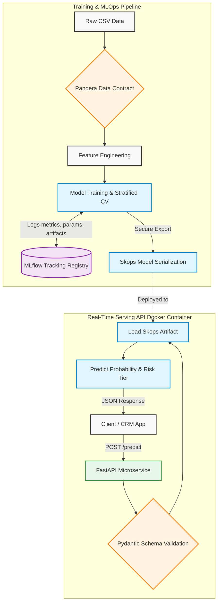

# System Architecture & MLOps Pipeline

This document outlines the end-to-end architecture of the Customer Churn Risk Intelligence system. The project
transitions a standard machine learning notebook into a modular, production-ready enterprise MLOps pipeline.

## System Design Diagram

## Architectural Breakdown

The pipeline is decoupled into distinct layers to ensure security, reproducibility, and scalability:

### 1. Strict Data Contracts (Validation Layer)

Silent data failures are a major issue in production ML. We utilize **Pandera** for training data and **Pydantic** for
real-time inference payloads. If a feature's data type changes or a categorical constraint is violated, the pipeline
fails early and loudly, preventing poisoned predictions.

### 2. Experiment Tracking & Registry

Instead of manually tracking hyperparameters and metrics in scattered JSON files, **MLflow** is integrated directly into
the `src/train.py` execution. Every run automatically logs exact data splits, model types (Logistic Regression,
LightGBM, RF), cross-validation metrics (ROC-AUC, PR-AUC), and the final model artifact.

### 3. Secure Serialization (Skops)

Standard Python `pickle` and `joblib` files are vulnerable to arbitrary code execution if intercepted. To adhere to
enterprise security standards, the selected model is serialized using **Skops**, which enforces strict type-checking and
prevents malicious payload execution during model loading.

### 4. Real-Time Serving API & Containerization

The serialized model is served via a **FastAPI** REST endpoint. The API handles incoming JSON payloads, applies the same
feature engineering logic used during training, and outputs a calibrated churn probability along with an actionable
business `RiskSegment` (Low, Moderate, High, Very High). The entire API environment is packaged into an immutable *
*Docker** container for frictionless deployment.

### 5. Continuous Integration (CI/CD)

The repository is governed by modern software engineering practices:

* **Ruff** for lightning-fast linting and formatting.
* **Pytest** for automated feature logic validation.
* **GitHub Actions & Release Please** for automated testing, conventional commit enforcement, and semantic versioning
  releases.
